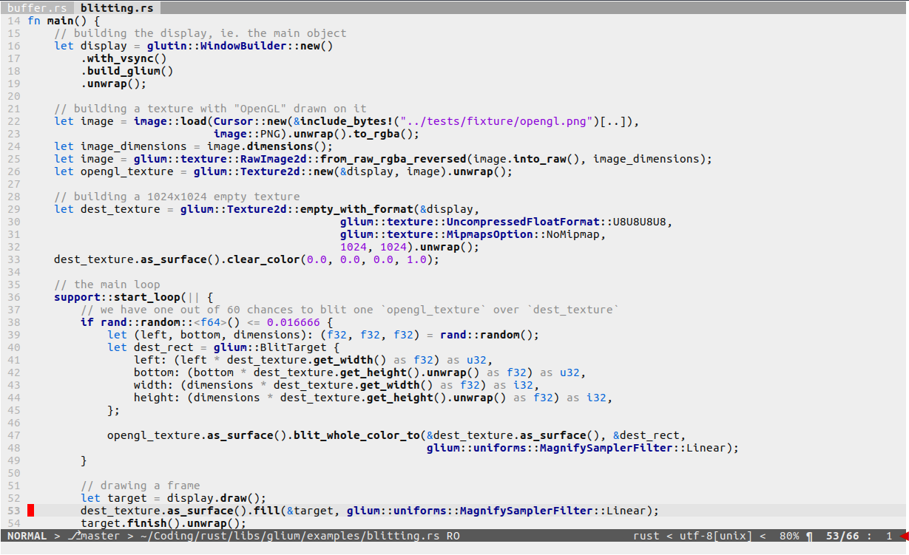
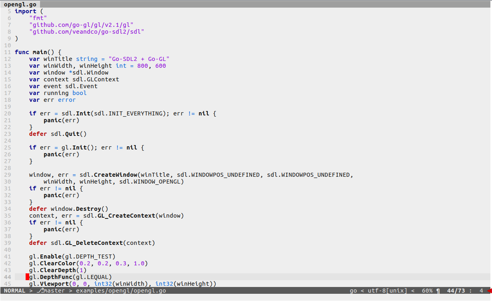
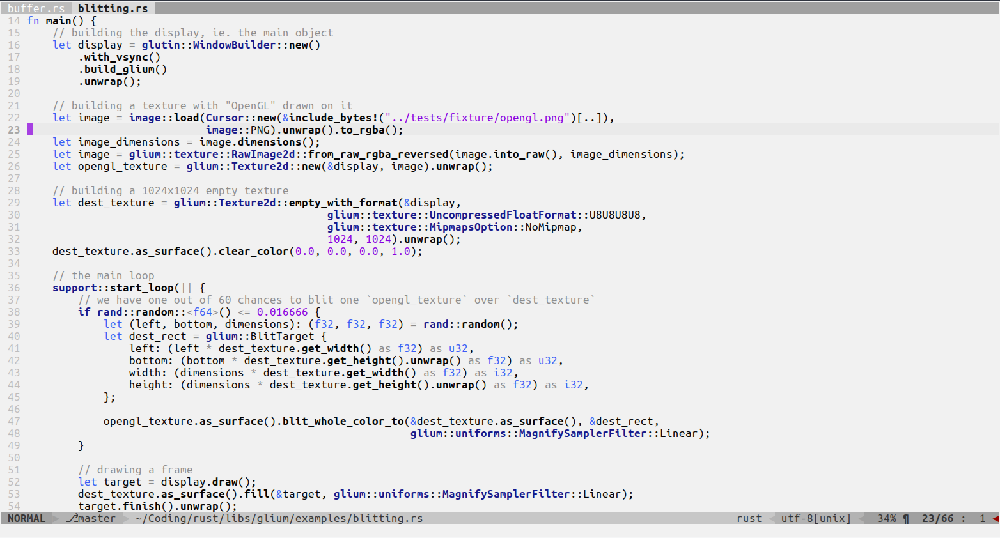
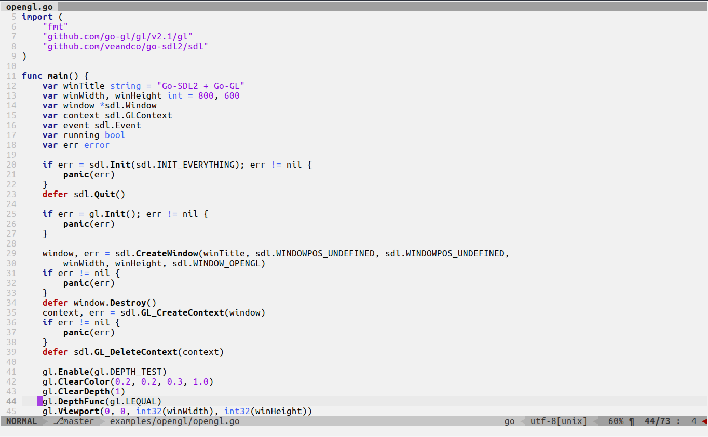

#ViZuki
A vim colorscheme with a light grey background easy on the eyes

##Screenshots
### Vim:

### Gvim:

### Diff:
... to be added

##Features
Coloring confirmed compatible with:
- [Airline](https://github.com/vim-airline/vim-airline)
- [Rust](https://github.com/rust-lang/rust.vim)
- [Go](https://github.com/fatih/vim-go)
- [GitGutter](https://github.com/airblade/vim-gitgutter)
- Diff
- Python
- More to be confirmed...
